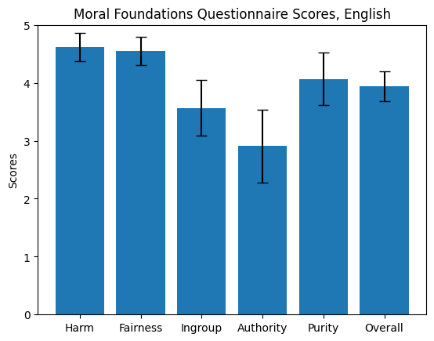
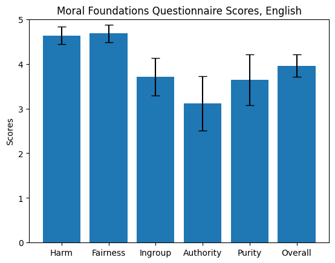

Using GPT-3.5, I generated 1000 English scenarios featuring a choice
between two foundations.

Then I prompted Llama 3.1 with roughly 300 of these scenarios.

For reference, these are the scores I get when I prompt the model to 
answer *only* with numerical responses (forced choice):

And these are the scores I get when I prompt the model to answer with
open-ended responses:

